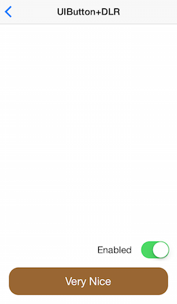
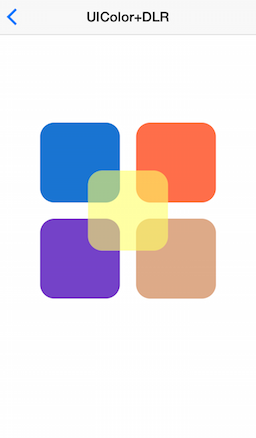

# DLRUIKit

[](https://travis-ci.org/detroit-labs/DLRUIKit)
[](http://cocoadocs.org/docsets/DLRUIKit)
[](http://cocoadocs.org/docsets/DLRUIKit)
[](http://cocoadocs.org/docsets/DLRUIKit)

## Installation

DLRUIKit is available through [CocoaPods](http://cocoapods.org). To install
it, simply add the following line to your Podfile:

```rb
pod "DLRUIKit"
```

## Author

Nathan Walczak, nate.walczak@detroitlabs.com

## License

DLRUIKit is available under the MIT license. See the LICENSE file for more info.

## Examples

### UIButton Category Examples

Normal State | Highlighted State | Disabled State
------------ | ----------------- | --------------
 |  | 

##### UIButton dlr_setBackgroundColor:forState:
```objc
[self.veryNiceButton dlr_setBackgroundColor:[UIColor brownColor] forState:UIControlStateNormal];
[self.veryNiceButton dlr_setBackgroundColor:[UIColor blueColor] forState:UIControlStateHighlighted];
[self.veryNiceButton dlr_setBackgroundColor:[UIColor lightGrayColor] forState:UIControlStateDisabled];
```

##### UIView dlr_applyRoundedCornersWithRadius:
```objc
[self.veryNiceButton dlr_applyRoundedCornersWithRadius:18.0f];
```

---
### UIColor Category Examples



##### UIColor dlr_colorWithRed:green:blue:
```objc
self.navyBlueView.backgroundColor = [UIColor dlr_colorWithRed:25 green:116 blue:210];
self.outrageousOrangeView.backgroundColor = [UIColor dlr_colorWithRed:255 green:110 blue:74];
self.purpleHeartView.backgroundColor = [UIColor dlr_colorWithRed:116 green:66 blue:200];
self.tumbleweedView.backgroundColor = [UIColor dlr_colorWithRed:222 green:170 blue:136];

self.unmellowYellowView.backgroundColor = [UIColor dlr_colorWithRed:255 green:255 blue:102 alpha:0.6f];
```

##### UIView dlr_applyRoundedCornersWithRadius:
```objc
[self.navyBlueView dlr_applyRoundedCornersWithRadius:18.0f];
[self.outrageousOrangeView dlr_applyRoundedCornersWithRadius:18.0f];
[self.purpleHeartView dlr_applyRoundedCornersWithRadius:18.0f];
[self.tumbleweedView dlr_applyRoundedCornersWithRadius:18.0f];

[self.unmellowYellowView dlr_applyRoundedCornersWithRadius:18.0f];
```

---
### UIViewController Category DLRParentViewController Examples

Screen Shot | Storyboard
----------- | ----------
 | 

```objc
UIViewController *childViewController = [self.storyboard instantiateViewControllerWithIdentifier:@"ChildViewController"];
  
[childViewController dlr_addToParentViewController:self parentView:self.containerView];
```

##### UIView dlr_applyRoundedCornersWithRadius:
```objc
[self.containerView dlr_applyRoundedCornersWithRadius:18.0f];
```
